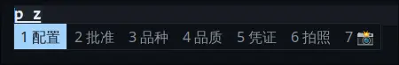

## 输入法

使用 `fcitx5` + `fcitx-rime` + `rime-ice-git` 的中文输入方案。



### 依赖：

```bash
fcitx5 # 输入法框架
fcitx-rime # Rime引擎
rime-ice-git # 雾凇拼音
fcitx5-configtool # 可选，UI配置工具
```

### 配置

Rime 配置在 `.local/share/fcitx5/rime` 目录下，这里在 `default.custom.yaml` 中自定义了 [雾凇拼音](https://github.com/iDvel/rime-ice) 相关配置项。

Fcitx 主题定义在 `.local/share/fcitx5/themes` 目录下。可使用 fcitx5-configtool 来设置主题为 `Github-Dark`，或直接在 `fcitx5/conf/classicui.conf` 配置文件里修改。

在 `/etc/environment` 中添加环境变量，重启后生效：

```bash
# /etc/environment

XMODIFIERS=@im=fcitx
QT_IM_MODULE=fcitx
```

