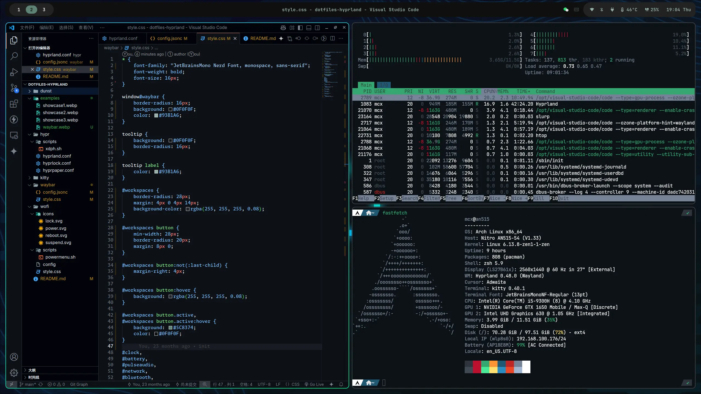
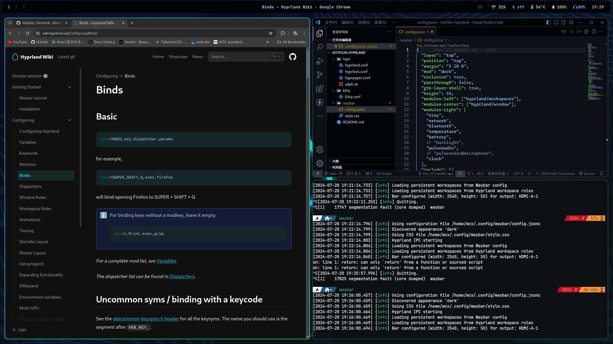
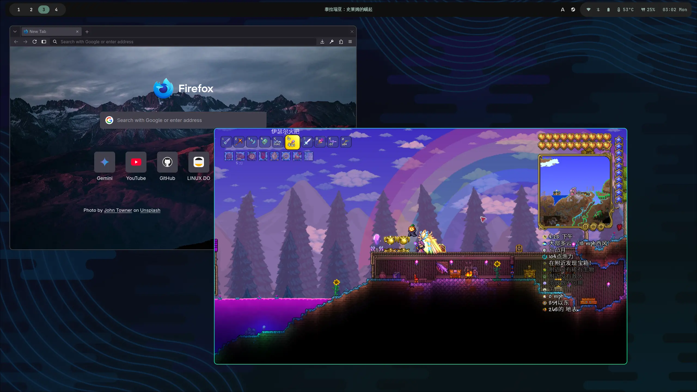

# Hyprland & ArchLinux
My daily-use config, collected from the Internet and customized for myself.

Reference: https://wiki.hyprland.org/









## Dependencies
> You are supposed to have `hyprland` already installed. And I'm using Nvidia Card, some configurations are specific to Nvidia card!

```bash
uwsm # Universal Wayland Session Manager
kitty # Terminal
dunst # Notification
waybar # Top Bar
brightnessctl # Screen brightness command line utils
pavucontrol # GUI pulseaudio controller
pipewire
pipewire-pulse # Audio
pipewire-alsa
wireplumber
hyprpaper # Wallpaper
hyprlock # lockscreen
hyprpicker # Color picker
feh # Image viewer
flameshot # Screenshot tool
rofi-wayland # application launcher
cliphist # clipboard
yazi # File Manager https://yazi-rs.github.io/docs/installation
gtk4 # Necessary for Chrome to use Fcitx5
seahorse # Password Manager
gnome-keyring # Store secrets, passwords, keys, certificates
hyprpolkitagent # Authentication Agent
qt6-wayland # Hyprland Need
qt5-wayland # Hyprland Need
qt6ct # QT theme config tool
xdg-desktop-portal-gtk # Chrome needed, choose file & upload something
xdg-desktop-portal-hyprland-git # Screen Sharing
nvidia-open-dkms # Nvidia driver
nvidia-vaapi-driver # Nvidia vaapi driver, for hardware acceleration
```

## Config
Here are few config options need to be set, to make apps run flawlessly.

### Fcitx5 + Rime

Chinese input method config. [Show Details](./.config/fcitx5/).

### Chromium

- Google Chrome `~/.config/chrome-flags.conf`
- VSCode `~/.config/code-flags.conf`

```bash
# Only use one of the 2 sections!!!
# For wayland native with buggy hardware acceleration
--use-angle=vulkan
--ozone-platform-hint=wayland
--enable-wayland-ime
--enable-gpu-rasterization
--enable-zero-copy
--ignore-gpu-blocklist

# For xwayland with hardware acceleration
--enable-features=UseOzonePlatform,AcceleratedVideoDecodeLinuxGL,AcceleratedVideoEncoder,VaapiVideoDecoder,VaapiIgnoreDriverChecks,Vulkan,DefaultANGLEVulkan,VulkanFromANGLE
--ozone-platform-hint=x11
--enable-gpu-rasterization
--enable-zero-copy
--ignore-gpu-blocklist
```

### Dark Theme
Install `Material-Black-Blueberry` theme or any you want.

Set as the current theme and prefer-dark preference:
```bash
gsettings set org.gnome.desktop.interface gtk-theme Material-Black-Blueberry
gsettings set org.gnome.desktop.interface color-scheme prefer-dark
```
