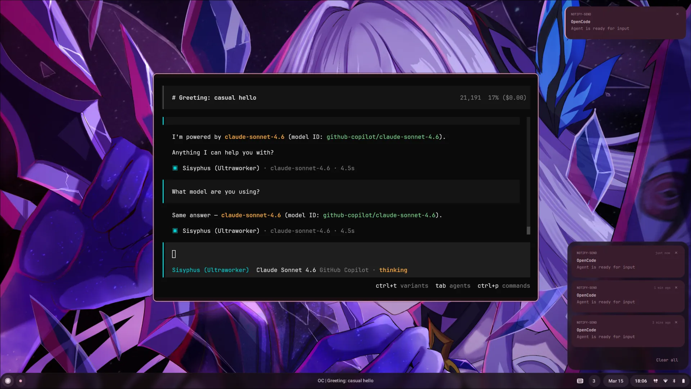
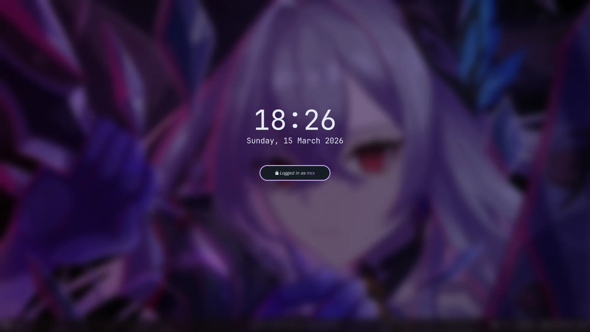
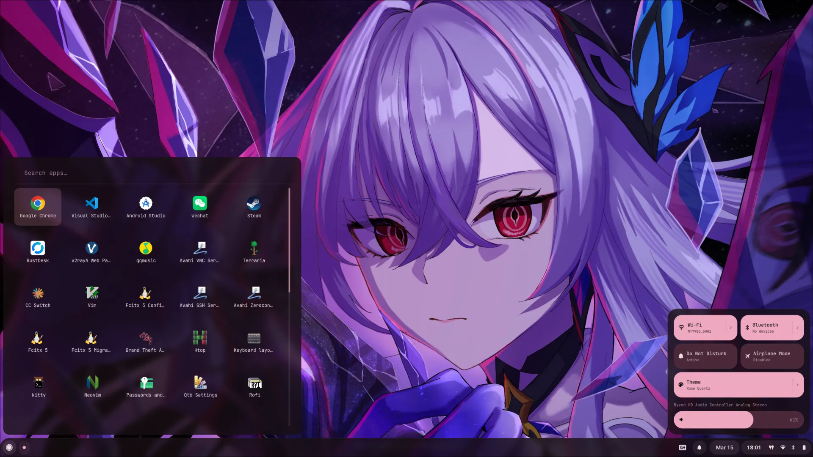
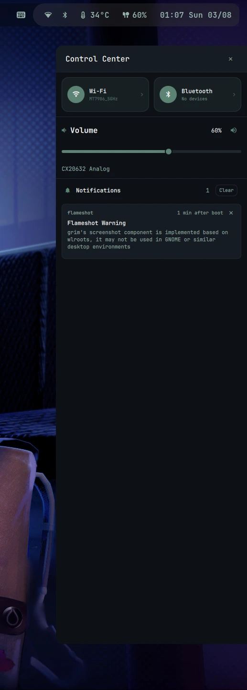
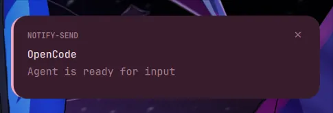
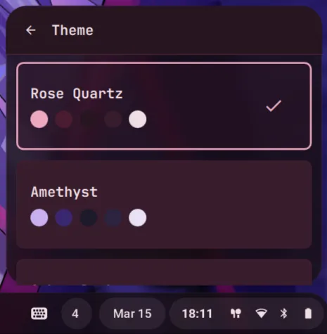
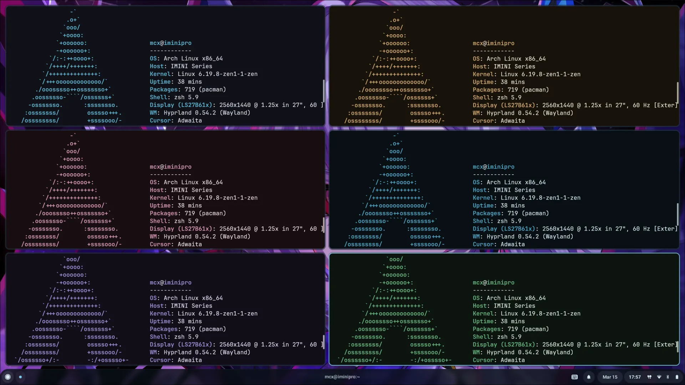

# Hyprland Dotfiles

Hyrpland dotfiles for Arch Linux — Chrome OS style with Material Design 3.

## Gallery

| Desktop | Lock Screen | App Launcher |
| :---: | :---: | :---: |
|  |  |  |

| Control Center | Notification | Theme Panel |
| :---: | :---: | :---: |
|  |  |  |

| Terminal |
| :---: |
|  |


## Prerequisites

- Arch Linux (or Arch-based distro)
- [Hyprland](https://wiki.hyprland.org/Getting-Started/Installation/) installed
- An AUR helper ([yay](https://github.com/Jguer/yay) or [paru](https://github.com/Morganamilo/paru)) is recommended

## Installation

```bash
git clone https://github.com/cxOrz/dotfiles-hyprland.git
cd dotfiles-hyprland
./install.sh
```

After installation, **log out and start a Hyprland session** via greetd.

### Post-install

```bash
# Set GTK dark theme
gsettings set org.gnome.desktop.interface gtk-theme Material-Black-Blueberry
gsettings set org.gnome.desktop.interface color-scheme prefer-dark

# Enable login manager
sudo systemctl enable greetd
```

## Keybindings

### General

| Key | Action |
| --- | --- |
| `Super + Q` | Terminal (Kitty) |
| `Super + E` | File Manager (Yazi) |
| `Super + Space` | App Launcher (Rofi) |
| `Super + X` | Close Window |
| `Super + F` | Toggle Floating |
| `Super + L` | Lock Screen |
| `Super + V` | Clipboard History |
| `Super + Escape` | Window Switcher |
| `Super + Delete` | Power Menu |
| `Super + A` | Control Center |
| `Super + Shift + S` | Screenshot |
| `Super + Shift + P` | Color Picker |

### Window Management

| Key | Action |
| --- | --- |
| `Super + Arrow Keys` | Move Focus |
| `Super + Shift + Arrow Keys` | Move Window |
| `Super + Ctrl + Arrow Keys` | Resize Window |
| `Super + P` | Pseudo Tile |
| `Super + J` | Toggle Split |

### Workspaces

| Key | Action |
| --- | --- |
| `Super + 1-0` | Switch to Workspace 1-10 |
| `Super + Shift + 1-0` | Move Window to Workspace 1-10 |
| `Super + Tab` | Next Workspace |
| `Super + [ / ]` | Previous / Next Workspace |
| `Super + Scroll` | Cycle Workspaces |

### Media

| Key | Action |
| --- | --- |
| `Volume Up/Down/Mute` | Audio Control |
| `Brightness Up/Down` | Screen Brightness |
| `Media Play/Next/Prev` | Playback Control |


## Directory Structure

```
.
├── .config/
│   ├── dunst/              # Notification daemon
│   ├── fcitx5/             # Chinese input method
│   ├── hypr/               # Hyprland window manager
│   │   ├── hyprland.conf   #   Main config (keybinds, rules, appearance)
│   │   ├── hyprlock.conf   #   Lock screen
│   │   ├── hyprpaper.conf  #   Wallpaper
│   │   ├── monitors.conf   #   Monitor setup
│   │   └── scripts/
│   ├── kitty/              # Terminal emulator
│   ├── quickshell/         # Custom desktop UI
│   │   ├── modules/
│   │   │   ├── controlcenter/  # WiFi, Bluetooth, Volume, Brightness, Themes
│   │   │   ├── notifications/  # Notification center + toast popups
│   │   │   ├── powermenu/      # Shutdown, Reboot, Suspend, Lock
│   │   │   └── shelf/          # Bottom bar with workspaces
│   │   ├── scripts/        # Theme switching script
│   │   ├── shell.qml       # Main shell entry point
│   │   └── Theme.qml       # Theme definitions (6 themes)
│   ├── rofi/               # App launcher
│   ├── uwsm/               # Wayland session environment
│   ├── waybar/             # Status bar
│   └── yazi/               # File manager
├── .local/share/
│   └── fcitx5/             # Rime config & input themes
├── examples/               # Screenshots
├── install.sh
├── uninstall.sh
├── LICENSE
└── README.md
```

## Dependencies

<details>
<summary>Full package list</summary>

| Package | Description |
| --- | --- |
| `uwsm` | Universal Wayland Session Manager |
| `greetd` | Login manager |
| `kitty` | Terminal emulator |
| `dunst` | Notification daemon |
| `quickshell` | QML-based desktop shell toolkit |
| `waybar` | Wayland status bar |
| `brightnessctl` | Screen brightness control |
| `pavucontrol` | PulseAudio volume GUI |
| `playerctl` | Media player control |
| `pipewire` | Audio server |
| `pipewire-pulse` | PulseAudio compatibility |
| `pipewire-alsa` | ALSA compatibility |
| `wireplumber` | PipeWire session manager |
| `hyprpaper` | Wallpaper manager |
| `hyprlock` | Lock screen |
| `hyprpicker` | Color picker |
| `hyprpolkitagent` | Authentication agent |

| `grim` | Wayland screenshot utility |
| `slurp` | Region selector |
| `satty` | Screenshot annotation tool |
| `rofi-wayland` | Application launcher |
| `wl-clipboard` | Wayland clipboard |
| `cliphist` | Clipboard history |
| `yazi` | Terminal file manager |
| `gtk4` | GTK4 (required for Fcitx5 in Chromium) |
| `qt6-wayland` | Qt6 Wayland support |
| `qt5-wayland` | Qt5 Wayland support |
| `qt6ct` | Qt6 theme configuration |
| `seahorse` | Password manager GUI |
| `gnome-keyring` | Secret/password storage |
| `xdg-desktop-portal-gtk` | GTK file picker portal |
| `xdg-desktop-portal-hyprland-git` | Hyprland screen sharing portal |
| `ttf-jetbrains-mono-nerd` | JetBrainsMono Nerd Font |

**Optional — Chinese input method:**

| Package | Description |
| --- | --- |
| `fcitx5` | Input method framework |
| `fcitx5-rime` | Rime engine |
| `rime-ice-git` | Rime Ice pinyin schema |
| `fcitx5-configtool` | Configuration GUI |

</details>

## Chinese Input Method

For Fcitx5 + Rime setup, see [.config/fcitx5/README.md](./.config/fcitx5/README.md).

## Uninstall

```bash
./uninstall.sh
```

This removes all symlinks created by the installer. Your backups remain in `~/.dotfiles-backup/`. Installed packages are not removed.

## License

[MIT](./LICENSE)
