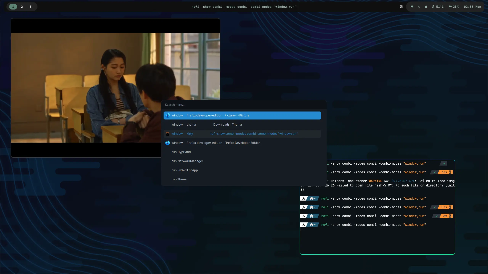

# Hyprland & ArchLinux
My daily-use config, collected from the Internet and customized for myself.

Reference: https://wiki.hyprland.org/





## Dependencies
> You are supposed to have `hyprland` already installed.

```bash
sddm-git # Login manager
kitty # Terminal
dunst # Notification
waybar-hyprland-git # Top Bar
brightnessctl # Screen brightness command line utils
pavucontrol # GUI pulseaudio controller
pipewire
pipewire-pulse # Audio
pipewire-alsa
wireplumber
hyprpaper # Wallpaper
hyprlock # lockscreen
grim # screenshot - Screenshot utility for Wayland
slurp # screenshot - select a region from Wayland compositors
wofi # application launcher
cliphist # clipboard
thunar # File explorer
gvfs # Show Trash, Computer and other devices in thunar
gtk4 # Necessary for Chrome to use Fcitx5
gnome-keyring # Store secrets, passwords, keys, certificates
polkit-kde-agent # Authentication Agent
qt6-wayland # Hyprland Need
qt5-wayland # Hyprland Need
qt5ct # Hyprland Need
xdg-desktop-portal-gtk # Chrome needed, choose file & upload something
xdg-desktop-portal-hyprland-git # Screen Sharing
nvidia-vaapi-driver # Nvidia vaapi driver, for hardware acceleration
```

## Config
Here are few config options need to be set, to make apps run flawlessly.

### Google Chrome

~/.config/chrome-flags.conf
```
--ozone-platform-hint=wayland
--enable-wayland-ime
--use-angle=opengl
```

### VS Code

If you need to enable fcitx5:

~/.config/code-flags.conf
```bash
--ozone-platform-hint=wayland
--enable-wayland-ime
--use-angle=opengl
```

If it takes long time to launch, try add `--disable-gpu` or just use x11:
```bash
--ozone-platform-hint=x11
--gtk-version=4
```

### SDDM

If you are using hybrid card (Intel+Nvidia), sddm might not showing on the external screen when you using HDMI, which can be solved by the following conifg:
```bash
# /usr/share/sddm/scripts/Xsetup
xrandr --setprovideroutputsource modesetting NVIDIA-0
```

/etc/sddm.conf
```
[General]
Numlock=on
```

### Dark Theme
Install `flat-remix-gtk` theme or any you want.

Set as the current theme and prefer-dark preference:
```bash
gsettings set org.gnome.desktop.interface gtk-theme Flat-Remix-GTK-Blue-Darkest
gsettings set org.gnome.desktop.interface color-scheme prefer-dark
```
